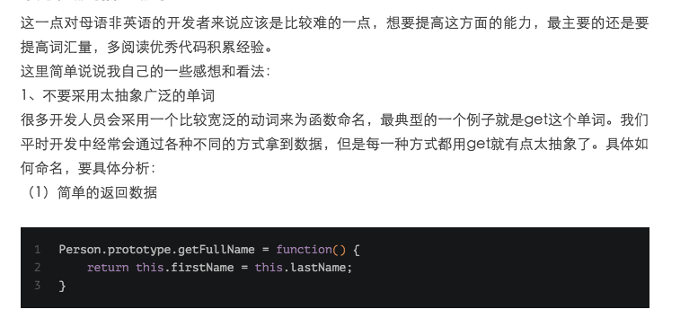
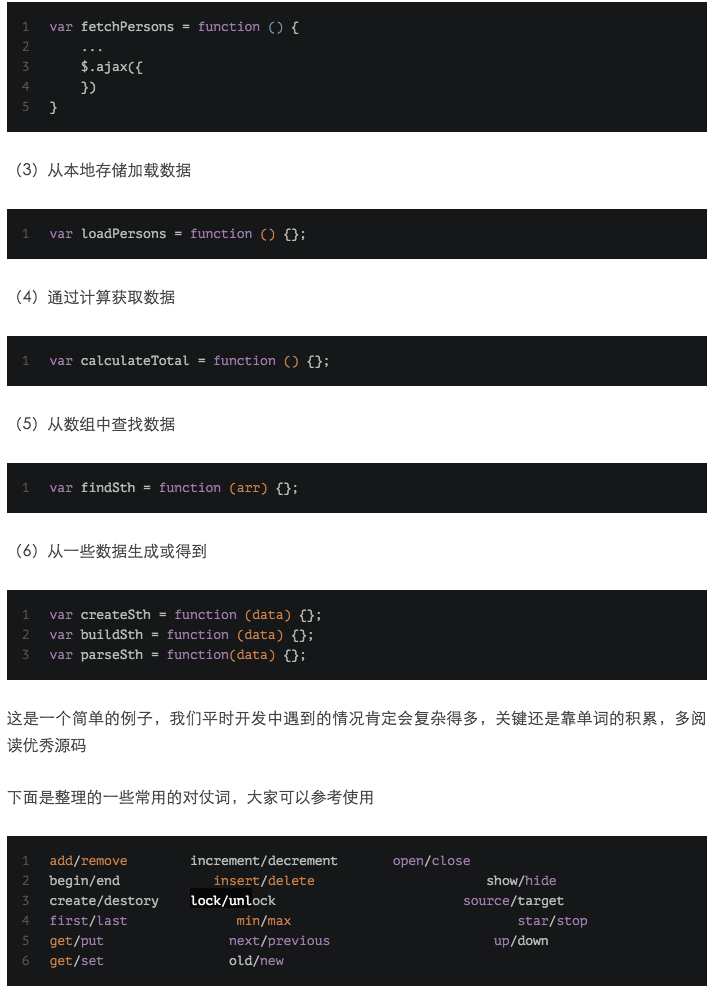

### **命名易读性规范**

**1.为了能让命名更加易懂和易读，尽量不要缩写/简写单词，除非这些单词已经被公认可以被这样缩写/简写。比如 `CustomThreadFactory` 不可以被写成 ~~`CustomTF` 。**

**2.命名不像函数一样要尽量追求短，可读性强的名字优先于简短的名字，虽然可读性强的名字会比较长一点。** 这个对应我们上面说的第 1 点。

**3.避免无意义的命名，你起的每一个名字都要能表明意思。**

正例：`UserService userService;` `int userCount`;

反例: `UserService service` `int count`

**4.避免命名过长（50 个字符以内最好），过长的命名难以阅读并且丑陋。**

5.**不要使用拼音，更不要使用中文。** 注意：像 alibaba 、wuhan、taobao 这种国际通用名词可以当做英文来看待。

正例：discount

反例：dazhe

## **Codelf:变量命名神器?**

这是一个由国人开发的网站，网上有很多人称其为变量命名神器， Guide 在实际使用了几天之后感觉没那么好用。小伙伴们可以自行体验一下，然后再给出自己的判断。

Codelf 提供了在线网站版本，网址：**[https://unbug.github.io/codelf/](https://link.zhihu.com/?target=https%3A//unbug.github.io/codelf/)**，具体使用情况如下：

我选择了 Java 编程语言，然后搜索了“序列化”这个关键词，然后它就返回了很多关于序列化的命名。

<figure data-size="normal"></figure>

并且，Codelf 还提供了 VS code 插件，看这个评价，看来大家还是很喜欢这款命名工具的。

<figure data-size="normal"></figure>

## **总结**

Guide 制作了一个涵盖上面所有重要内容的思维导图，便于小伙伴们日后查阅。

<figure data-size="normal"></figure>

## **其他推荐阅读**
